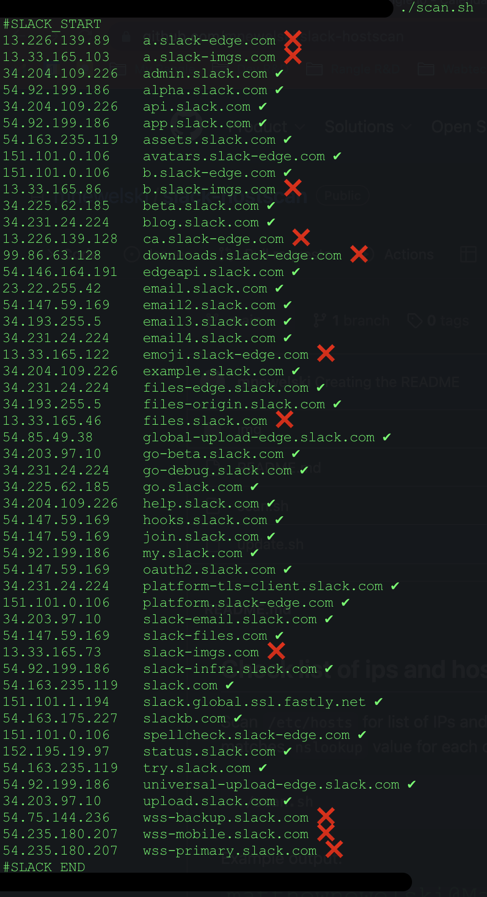

## Check list of ips and hosts in /etc/hosts against the response form nslookup
Scan `/etc/hosts` for list of IPs and hostnames between `#SLACK_START` and `#SLACK_END` and check if the IP still matches `nslookup` value for each of the domains:

    ./scan.sh

Example output:

Scan `/etc/hosts` for the same as above but output a list with updated IPs (if needed) in a format that can be copied and pasted back to `/etc/hosts`:

    ./update.sh

Example output:

